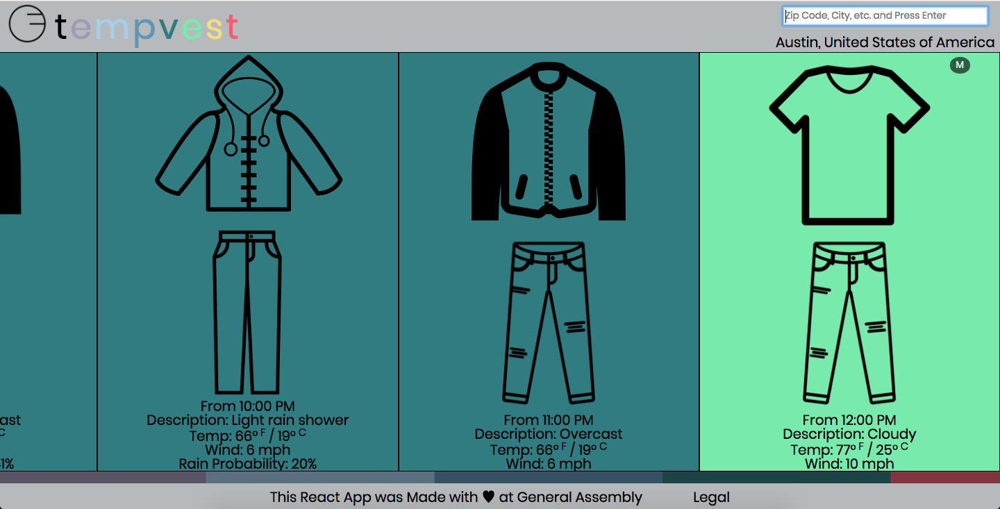

# Tempvest

Live in an area where the weather vastly varies throughout the day and want to know how you should dress accordingly? Tempvest gives you a layout of clothing options for what you'll need when weather conditions change or the temperature differs a significant amount.

## Table of Contents
- [Acknowledgments](#Acknowledgments)
- [Components](#components)
  - [Tempvest](#tempvest)
  - [Header](#header)
  - [Search](#search)
  - [Body](#body)
  - [Card](#card)
  - [Footer](#footer)
- [Functions](#functions)
  - [_filterArr](#filterArr)
  - [_formatTime](#formatTime)
  - [_generateImages](#generateImages)
  - [_getColor](#getColor)
  - [_getWeatherInfo](#getWeatherInfo)

## Acknowledgements
This project was bootstrapped with [Create React App](https://github.com/facebookincubator/create-react-app).

This project uses the World Weather Online [API](https://developer.worldweatheronline.com/api/docs/local-city-town-weather-api.aspx).

## Components

#### Tempvest

This is the main component which gets rendered in the root element of the DOM. Initializes state for the weather, gender, and location. `_updateData` and `_updatePreferences` are used to set the component's state from child components by passing them as properties.

*Renders `Header`, `Body`, and `Footer` components.*

#### Header

*Takes `_updateData` function and location as props*

Header shows you the Tempvest logo and name, as well as displays the search bar and the name of the location being searched.

*Renders `Search` component*

#### Search

*Takes `_updateData` function and location as props*

Search is where the Axios call to World Weather Online is made and passed up when information is received. When the DOM is loaded, autofocus is given to the text input to allow for the quickest access.

#### Body

*Takes `_updatePreferences` function and Tempvest's state as props*

The body is where the `Card` components are displayed.

*Renders array of `Card` components*

#### Card

*Takes in Tempvest's state and search data*

Displays  weather information, given properties passed down by the `Body` component. Updates whenever the Axios call in the `Search` component is sent and information is returned.

#### Footer

Contains toggle to display credit for NounProject artists.

## Functions

### _filterArr

*Used in `Tempvest` component*

Takes in the useable 'weather' array created after the `Search` component's Axios call, which contains 24 nested arrays with the current day's hourly forecast. `_filterArr` iterates through the array, two at a time, compares them and splices out the second if the temperature is too similar or if there is no change in weather conditions.

### _formatTime

*Used in `Card` component*

Slightly modified from a [stackoverflow answer](https://stackoverflow.com/questions/14415618/replace-military-time-to-normal-time-with-javascript), `_formatTime` takes the time value from the API call and converts it into International Standard Time Notation.

### _genetateImages

*Used in `Card` component*

With the object returned by `_getWeatherInfo` and the properties passed down by `Body`, `_generateImages` returns an array of two images, one for tops and one for bottoms based on the temperature and weather conditions.

### _getColor

*Used in `Card` component*

Returns a pre-selected color for the background of the card depending on the level returned by `_getWeatherInfo`.

### _getWeatherInfo

*Used in `Card` component*

Using the filtered array from `_filterArr`, returns an object that returns the 'level' (temperature ranges), booleans that are true if rain or snow are in the descriptions or if their respective positivities are high enough, and the temperature.
